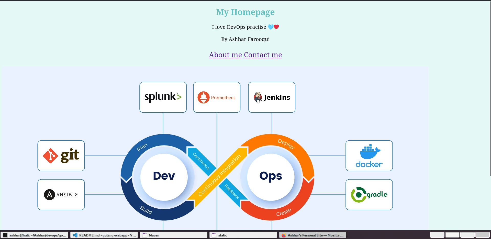

# Hello Fellas 👋

This is a simple website written in Golang. It uses the `net/http` package to serve HTTP requests.
# To Run the server

execute the following command:

```bash
go run main.go
```

The server will start on port 8080. You can access it by navigating to `http://localhost:8080/home` in your web browser.

## Looks like this




